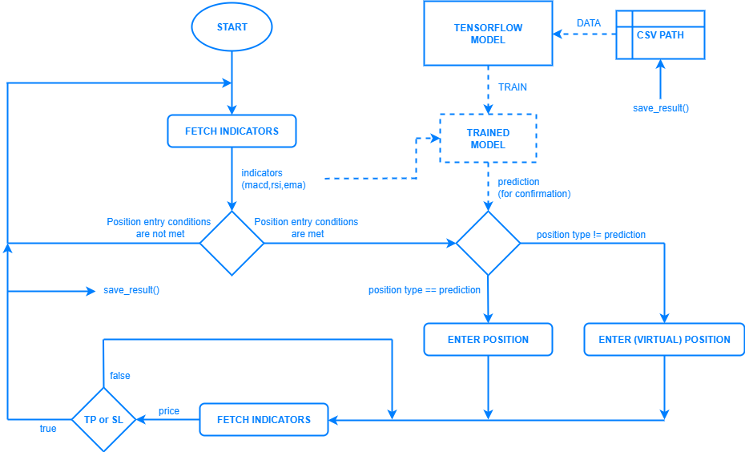

<div align="center">
  
</div>

[](https://www.python.org/downloads/)
[](#)
[](https://github.com/yy-trading-bots/mera-bot/actions/workflows/ci.yml)
[](https://github.com/yy-trading-bots/mera-bot/blob/master/LICENSE)

# MeraBot

> An automated cryptocurrency trading bot for **Binance** that combines MACD, EMA, and RSI indicators with Artificial Intelligence to detect and confirm **LONG/SHORT** signals.

---

## 📖 Description

MeraBot is a Python trading bot that connects to the Binance API and detects LONG and SHORT signals through the use of technical analysis. These signals are then **confirmed by a model trained with TensorFlow on past position results**, and only if validated does the bot enter a position. The codebase has clear abstractions with object-oriented design and pragmatic design patterns to remain clean and maintainable without sacrificing functionality. The project also serves as a concise reference implementation for developers building their own trading bots.

---

## 🎯 Strategy

> **MERA** = **M**ACD + **E**MA + **R**SI + **A**rtificial Intelligence

This bot relies on the following indicator set:

- **Trend filter (EMA)** – Evaluates the price relative to the 100-period Exponential Moving Average (`EMA_100`) to determine whether the market bias is bullish or bearish.
- **Momentum (MACD)** – Uses the relationship between the MACD line and the signal line to assess both the direction and strength of the trend.
- **Momentum (RSI)** – Applies a short-period RSI threshold around the 50 level to confirm the momentum direction and filter out false signals.

hese indicators are used to determine the position type. The position entry conditions are as follows:

Long position entry condition (pseudocode):

```py
  long_condition = price > EMA_100 and MACD_line crosses_above signal and RSI > 50
```

Short position entry condition (pseudocode):

```py
  short_condition = price < EMA_100 and MACD_line crosses_below signal and RSI < 50
```

Then, when one of these two conditions is met, the bot initializes a model trained with previous position results and makes a prediction:

```py
  # TFModel class is defined in src/tensorflow_model/tf_model.py
  model = TFModel()

  # this model is a binary classifier and returns "LONG" or "SHORT"
  prediction = model.predict()
```

> The TFModel class is provided as a template. You may implement the model layers in `src/tensorflow_model/tf_model.py`, within the `TFModel` class’s `_build_model()` function.

When the prediction is done, it confirms the position type decided before and enters a position:

```py
  if long_condition and prediction == "LONG":
    enter_long()
  elif short_condition and prediction = "SHORT":
    enter_short()
```

After a position is entered, the bot continuously monitors the price to determine whether the take-profit (TP) or stop-loss (SL) thresholds have been hit.

The flow diagram of the bot is as follows:

<div align="center">
  
</div>

---

## ⚙️ Configuration

First, rename `settings.example.toml` to **`settings.toml`** and edit the fields to match your preferences.

| Key              | Section      |    Type |     Default | Description                                                                                   | Example              |
| ---------------- | ------------ | ------: | ----------: | --------------------------------------------------------------------------------------------- | -------------------- |
| `PUBLIC_KEY`     | `[API]`      |  string |        `""` | Your Binance API key. Grant only the permissions you actually need. **Do not commit to VCS.** | `"AKIA..."`          |
| `SECRET_KEY`     | `[API]`      |  string |        `""` | Your Binance API secret. Keep it secret and out of the repo.                                  | `"wJalrXUtnFEMI..."` |
| `SYMBOL`         | `[POSITION]` |  string | `"ETHUSDT"` | Trading symbol (e.g., USDT-M futures or spot pair).                                           | `"BTCUSDT"`          |
| `COIN_PRECISION` | `[POSITION]` | integer |         `2` | Quantity precision for orders. Must align with the exchange **lot size** rules.               | `3`                  |
| `TP_RATIO`       | `[POSITION]` |   float |    `0.0050` | Take-profit distance **relative to entry**. `0.0050` = **0.5%**.                              | `0.0100`             |
| `SL_RATIO`       | `[POSITION]` |   float |    `0.0050` | Stop-loss distance **relative to entry**. `0.0050` = **0.5%**.                                | `0.0075`             |
| `LEVERAGE`       | `[POSITION]` | integer |         `1` | Leverage to apply (for futures). Use responsibly.                                             | `5`                  |
| `TEST_MODE`      | `[RUNTIME]`  |    bool |      `true` | Paper/Test mode. When `true`, no live orders are sent (or a testnet is used).                 | `false`              |
| `DEBUG_MODE`     | `[RUNTIME]`  |    bool |     `false` | Verbose logging and extra assertions.                                                         | `true`               |
| `INTERVAL`       | `[RUNTIME]`  |  string |     `"15m"` | Indicator/candle interval (e.g., `1m`, `5m`, `15m`, `1h`, ...).                               | `"1h"`               |
| `SLEEP_DURATION` | `[RUNTIME]`  |   float |      `30.0` | Delay (seconds) between loops to respect API limits.                                          | `10.0`               |

**Where to get API keys:** Binance → **API Management**: [https://www.binance.com/en/my/settings/api-management](https://www.binance.com/en/my/settings/api-management)

> Tips
>
> - Keep `COIN_PRECISION` in sync with `exchangeInfo` (lot/tick size) to invalid rejected orders.

---

## ▶️ How to Run

> Ensure `settings.toml` is properly configured **before** running.

There are two ways to run the bot, and you may choose whichever best suits your needs.

### 1) Docker

```bash
# Build the image
docker build -t merabot .

# Run (Linux/macOS)
docker run --rm \
  -v "$(pwd)/src:/app/src" \
  merabot

# Run (Windows CMD)
docker run --rm \
  -v "%cd%\src:/app/src"
  merabot
```

> The volumes mount your local `src/` for output log files.

### 2) Python (virtualenv)

```bash
# Create a virtual environment
python -m venv .venv

# Activate
# Linux/macOS
source ./.venv/bin/activate
# Windows CMD
.\.venv\Scripts\activate

# Install dependencies
pip install -r requirements.txt

# Run
python src/main.py   # direct module/script
```

---

## ⚠️ Warnings

> **Disclaimer:** Trading cryptocurrencies — especially with **leverage** — involves **significant risk**. This bot is **not financial advice** and is provided for educational/experimental purposes only. Review the code and the strategy thoroughly, start small, and only trade with funds you can afford to lose. **All P\&L is your responsibility.**
>
> Protect your API keys, never commit secrets, and be aware of operational risks such as rate limits, network issues, exchange maintenance, and **slippage**, all of which can materially affect performance.
